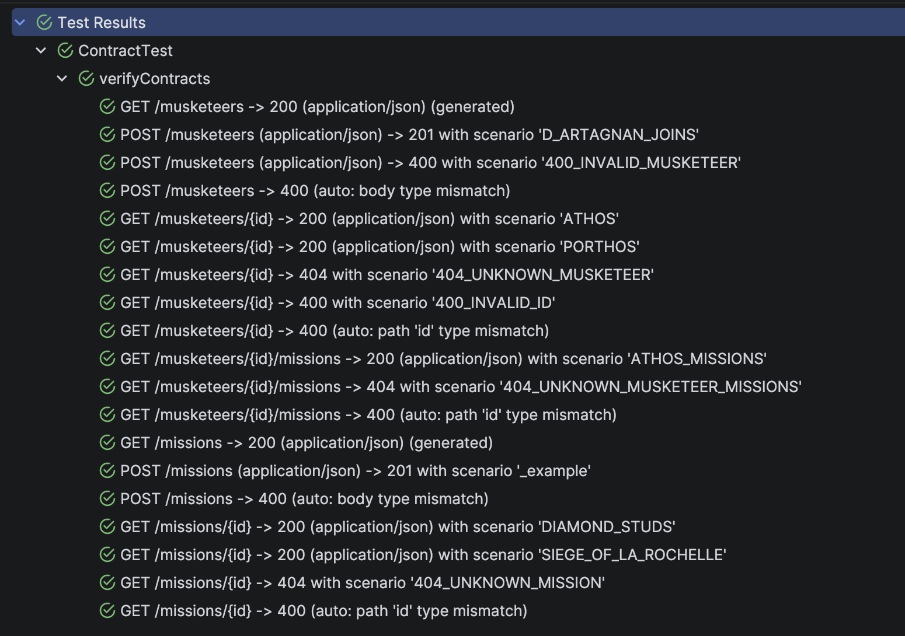

# musketeer-spring-boot-server

Spring Boot implementation of the Musketeer API, verified
against its OpenAPI specification using
[contracteer-verifier-junit](https://github.com/sabai-tech/contracteer/tree/main/contracteer-verifier-junit).
This project walks through the setup, the test data
strategy, and what Contracteer generates from the spec.

See the [Verify Your API with JUnit 5](https://sabai-tech.github.io/contracteer/latest/getting-started/verifier-junit/) guide for the full documentation.

## Prerequisites

- Java 21
- `musketeer-spec` published to Maven Local
  (see [musketeer-spec](../musketeer-spec/))

## Dependencies

```kotlin
// Contract verification
testImplementation("tech.sabai.contracteer:contracteer-verifier-junit:<version>")

// OpenAPI specification
implementation("tech.sabai.contracteer.examples:musketeer-spec:1.0.0")
```

## The Contract Test

The entire contract test is a single annotated method:

```java
@SpringBootTest(webEnvironment = RANDOM_PORT)
class ContractTest {

  @ContracteerServerPort
  @LocalServerPort
  int port;

  @Autowired
  MusketeerRepository musketeerRepository;

  @Autowired
  MissionRepository missionRepository;

  @ContracteerTest(openApiDoc = "classpath:musketeer-api.yaml")
  void verifyContracts() {
    musketeerRepository.clear();
    missionRepository.clear();

    musketeerRepository.save(new Musketeer(1, "Athos", MUSKETEER, "Rapier"));
    musketeerRepository.save(new Musketeer(2, "Porthos", MUSKETEER, "Musket"));
    musketeerRepository.save(new Musketeer(3, "Aramis", MUSKETEER, "Rapier"));

    missionRepository.save(new Mission(1,
            "The Diamond Studs",
            "Retrieve the Queen's diamond studs from the Duke of Buckingham",
            MissionStatus.COMPLETED,
            List.of("Athos", "Porthos", "Aramis", "d'Artagnan")));

    missionRepository.save(new Mission(2,
            "The Siege of La Rochelle",
            "Defend the bastion Saint-Gervais during the siege",
            MissionStatus.COMPLETED,
            List.of("Athos", "Porthos", "Aramis", "d'Artagnan")));
  }
}
```

- `@ContracteerTest` generates one JUnit test per verification
case. The method body runs before each case, seeding the
database with the data that the OpenAPI examples expect.

- `@ContracteerServerPort` combined with `@LocalServerPort`
wires Spring Boot's random port into Contracteer.

- `openApiDoc` accepts a file path, an HTTP(S) URL, or a
classpath resource (e.g. `classpath:openapi.yaml`). Here
the spec comes from the `musketeer-spec` dependency on the
classpath.

## Running the Tests

```bash
./gradlew test
```

Contracteer reads the specification and generates one JUnit
test per verification case:



The test tree shows four kinds of verification cases. The
following sections walk through each one using concrete
examples from this specification.

### Named Scenarios

A named scenario links request values to a response for a
specific status code. Contracteer creates scenarios from
example keys that appear on both request and response
elements.

In the specification, `GET /musketeers/{id}` defines the
key `ATHOS` on both the path parameter and the response
body:

```yaml
/musketeers/{id}:
  get:
    parameters:
      - name: id
        in: path
        schema:
          type: integer
        examples:
          ATHOS:
            value: 1
    responses:
      '200':
        content:
          application/json:
            schema:
              $ref: '#/components/schemas/Musketeer'
            examples:
              ATHOS:
                value:
                  id: 1
                  name: Athos
                  rank: MUSKETEER
                  weapon: Rapier
```

The shared key `ATHOS` creates one scenario: Contracteer
sends `GET /musketeers/1` and validates that the response
matches the `Musketeer` schema. The test seeds the
corresponding data:

```java
musketeerRepository.save(new Musketeer(1, "Athos", MUSKETEER, "Rapier"));
```

The key `PORTHOS` works the same way, producing a second
scenario for `GET /musketeers/2`.

### Status-Code-Prefixed Scenarios

Keys matching the pattern `{statusCode}_{description}`
target a specific response status code directly. The
response does not need a matching example -- the key alone
is enough.

```yaml
examples:
  404_UNKNOWN_MUSKETEER:
    value: 999
```

Contracteer sends `GET /musketeers/999` and expects a 404
response. Since the spec declares `404` with no body, only
the status code is validated.

Similarly, `400_INVALID_MUSKETEER` on `POST /musketeers`
sends an intentionally invalid request body (rank `KNIGHT`
is not in the enum) and expects a 400 response with a body
matching the `ProblemDetail` schema.

### Automatic Type-Mismatch 400s

When an operation defines a 400 response, Contracteer
automatically generates verification cases that send
type-mismatched values -- even without explicit 400
examples.

For `GET /musketeers/{id}`, the path parameter `id` is
declared as `type: integer`. Contracteer sends a string
value instead and validates that the server returns 400
with a body matching the `ProblemDetail` schema. This
works for every operation that declares a 400 response.

### Schema-Only Fallback

`GET /musketeers` and `GET /missions` have no `examples`
in the specification. Contracteer generates a verification
case using random values that conform to the schema and
validates the response structure.

## Data Seeding

The method body runs before *each* verification case, not
once for all of them. Each case starts from a clean,
known state:

```java
musketeerRepository.clear();
missionRepository.clear();

musketeerRepository.save(new Musketeer(1, "Athos", MUSKETEER, "Rapier"));
// ...
```

The seeded IDs must match the OpenAPI examples. Athos
has id `1` because the `ATHOS` example uses `value: 1`
for the path parameter. Porthos has id `2` because the
`PORTHOS` example uses `value: 2`. If no musketeer with
id 1 exists, the `ATHOS` scenario fails -- Contracteer
sends `GET /musketeers/1` expecting a 200 response, but
the server returns 404.

The verifier checks schema conformance, not value
equality. If Athos existed with a different weapon, the
test would still pass because the response conforms to
the `Musketeer` schema. What matters is that the right
resources exist at the right IDs so the server returns
the expected status code.

Operations without named scenarios (like `GET /musketeers`)
still work because the server returns whatever is in the
database, and the verifier checks the response structure,
not specific values.

## Error Responses

The specification defines 400 responses with content type
`application/problem+json` and a `ProblemDetail` schema:

```yaml
'400':
  description: Invalid input
  content:
    application/problem+json:
      schema:
        $ref: '#/components/schemas/ProblemDetail'
```

The server's `GlobalExceptionHandler` converts Spring's
validation and type-mismatch exceptions into RFC 7807
Problem Details in this format. This matters because
Contracteer validates the response body against the
`ProblemDetail` schema for both status-code-prefixed 400
scenarios (like `400_INVALID_MUSKETEER`) and automatic
type-mismatch cases.

## Running the Server

```bash
./gradlew bootRun
```

The server starts on `http://localhost:8080`. Swagger UI
is available at `/swagger-ui/index.html`, serving the
OpenAPI specification directly.
